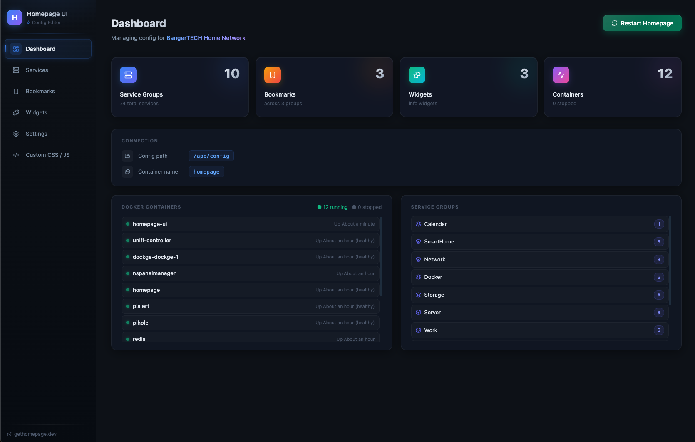
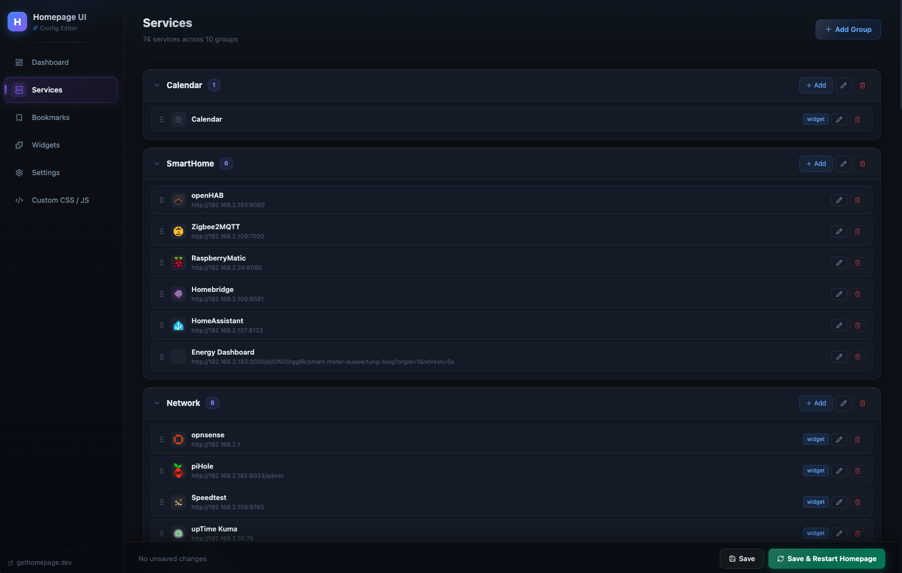
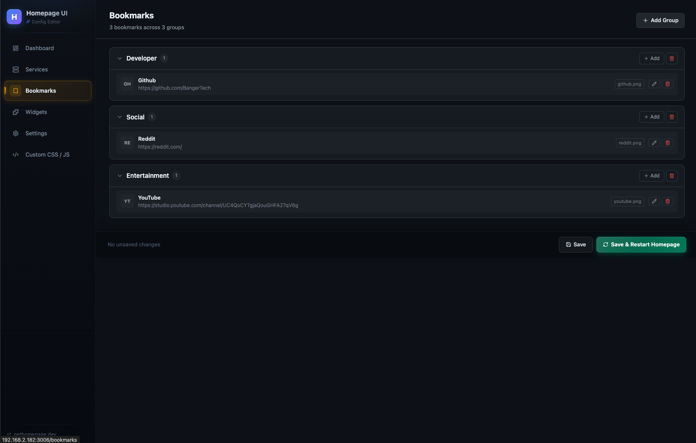
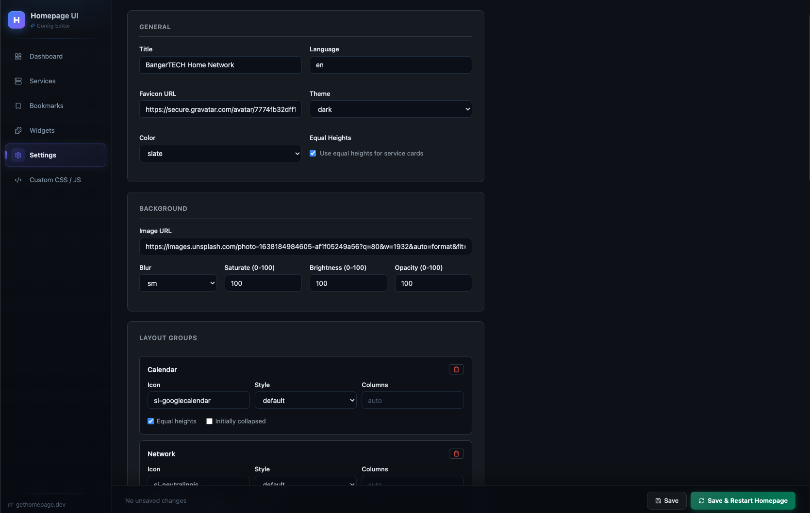

# Homepage UI

> A visual web editor for [gethomepage/homepage](https://github.com/gethomepage/homepage) — manage your self-hosted dashboard without touching YAML.


---

## What is this?

[gethomepage/homepage](https://github.com/gethomepage/homepage) is a beautiful self-hosted dashboard — but configuring it requires manually editing YAML files. **Homepage UI** sits alongside your homepage container and gives you a clean point-and-click interface to manage everything.

---

## Features

- **Setup Wizard** — first-run wizard to connect to your homepage config directory and Docker container
- **Services Editor** — add, edit, delete and reorder service groups and services (including widget configuration)
- **Bookmarks Editor** — manage bookmark groups with icons, abbreviations and URLs
- **Widgets Editor** — configure info widgets (resources, search, weather) with typed forms
- **Settings Editor** — edit appearance, layout groups and app configuration
- **Custom CSS / JS** — edit `custom.css` and `custom.js` directly in the browser
- **One-click Restart** — restart the homepage container via Docker socket after saving
- **Dark theme** — GitHub-inspired dark UI

---

## Screenshots

| Dashboard | Services Editor |
|---|---|
|  |  |

| Bookmarks Editor | Settings |
|---|---|
|  |  |

---

## Quick Start

### Prerequisites

- Docker + Docker Compose
- A running [gethomepage/homepage](https://github.com/gethomepage/homepage) container

### 1. Clone the repository

```bash
git clone https://github.com/BangerTech/homepage-ui.git
cd homepage-ui
```

### 2. Adjust `docker-compose.yml`

Edit the volume path to point to your homepage config directory:

```yaml
volumes:
  - /your/path/to/homepage/config:/app/config   # ← change this
  - /var/run/docker.sock:/var/run/docker.sock
  - homepage-ui-data:/app/data
```

### 3. Start

```bash
docker compose up -d --build
```

Open **http://your-server-ip:3006** in your browser and follow the setup wizard.

---

## Configuration

On first launch, the setup wizard will ask for:

| Setting | Description | Example |
|---|---|---|
| **Config Path** | Path to the homepage config directory **inside this container** | `/app/config` |
| **Container Name** | Name of your homepage Docker container | `homepage` |

Settings are stored in a persistent Docker volume at `/app/data/app-settings.json`.

---

## docker-compose.yml (full example)

```yaml
services:
  homepage-ui:
    image: ghcr.io/bangertech/homepage-ui:latest   # or build: .
    container_name: homepage-ui
    ports:
      - 3006:3000
    volumes:
      - /your/path/to/homepage/config:/app/config
      - /var/run/docker.sock:/var/run/docker.sock
      - homepage-ui-data:/app/data
    restart: unless-stopped

volumes:
  homepage-ui-data:
```

### Image tags

| Tag | When |
|---|---|
| `latest` | Latest build from `main` |
| `X.Y.Z` / `X.Y` | Git tags like `v0.3.1` |
| `sha-<short>` | Every published commit |

Multi-arch: `linux/amd64` and `linux/arm64`.

---

## Tech Stack

| Technology | Purpose |
|---|---|
| [Next.js 16](https://nextjs.org) (App Router) | Full-stack React framework |
| [TypeScript 5](https://www.typescriptlang.org) | Type safety |
| [Tailwind CSS v4](https://tailwindcss.com) | Styling |
| [js-yaml](https://github.com/nodeca/js-yaml) | YAML parsing & serialization |
| [dockerode](https://github.com/apocas/dockerode) | Docker socket API |
| [lucide-react](https://lucide.dev) | Icons |

---

## API Routes

| Method | Route | Description |
|---|---|---|
| `GET` | `/api/app-settings` | Read app settings |
| `PUT` | `/api/app-settings` | Save app settings |
| `GET` | `/api/config/:file` | Read a config file |
| `PUT` | `/api/config/:file` | Write a config file |
| `POST` | `/api/config/test` | Validate a config path |
| `POST` | `/api/docker/restart` | Restart homepage container |
| `POST` | `/api/docker/test` | Check if container exists |

---

## Development

```bash
# Requires Node.js 22+
npm install
npm run dev   # http://localhost:3000
```

For local development, set `DATA_PATH` to a writable directory:

```bash
export DATA_PATH="/tmp/homepage-ui-dev-data"
mkdir -p "$DATA_PATH"
npm run dev
```

---

## Do I need to restart homepage after saving?

**No.** Homepage watches its config files and reloads automatically when they change. Just hit **Save** and refresh your homepage tab. The **Save & Restart** button is only needed if homepage is unresponsive or you've changed environment-level settings.

---

## Contributing

Pull requests are welcome! For major changes, please open an issue first.

1. Fork the repo
2. Create a feature branch (`git checkout -b feature/my-feature`)
3. Commit your changes
4. Push and open a Pull Request

---

## Author

**BangerTech** — [github.com/BangerTech](https://github.com/BangerTech)

---

## License

[MIT](LICENSE)
